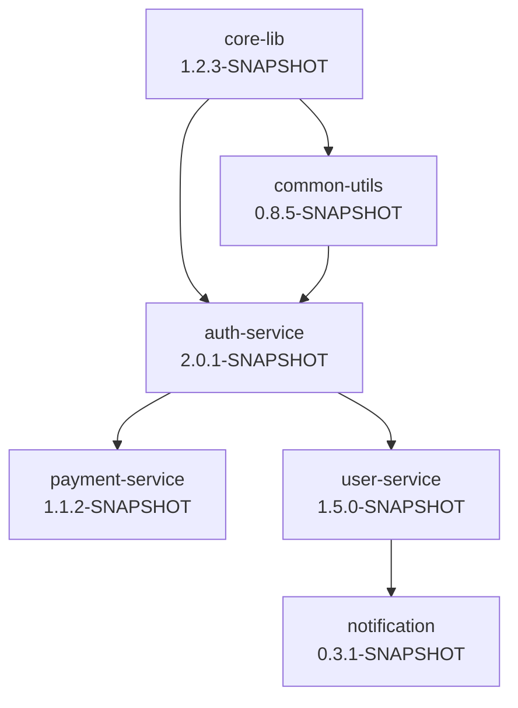
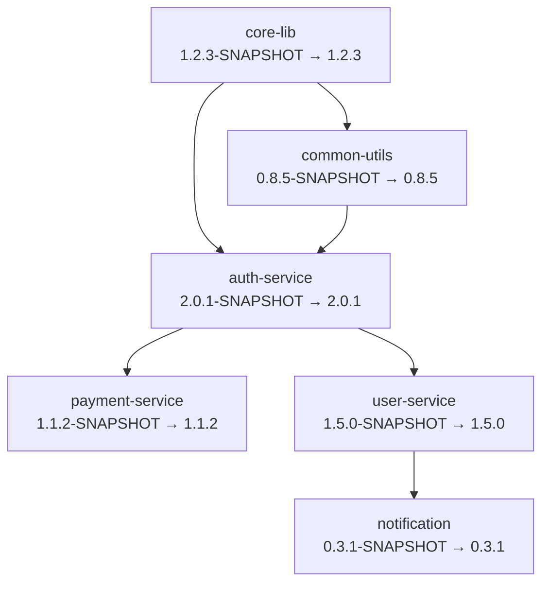
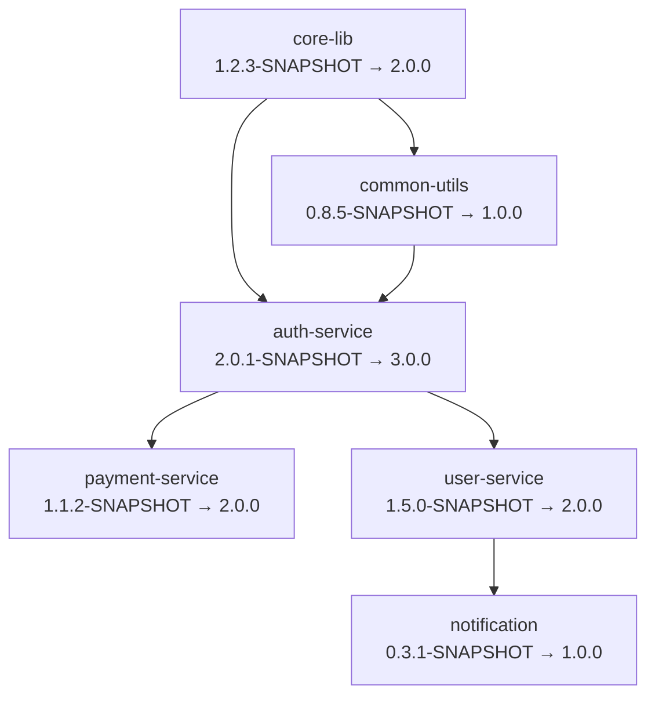

# Multi-Repository Release Example

This example demonstrates how the Maven Bulk Release tool handles version transformations across a complex multi-repository project with different version increment strategies.

## Project Structure

Consider a microservices ecosystem with the following repositories and their dependencies:



## Initial State

### Repository: core-lib (v1.2.3-SNAPSHOT)
```xml
<groupId>com.example</groupId>
<artifactId>core-lib</artifactId>
<version>1.2.3-SNAPSHOT</version>
```

### Repository: common-utils (v0.8.5-SNAPSHOT)
```xml
<groupId>com.example</groupId>
<artifactId>common-utils</artifactId>
<version>0.8.5-SNAPSHOT</version>
<dependencies>
    <dependency>
        <groupId>com.example</groupId>
        <artifactId>core-lib</artifactId>
        <version>1.2.3-SNAPSHOT</version>
    </dependency>
</dependencies>
```

### Repository: auth-service (v2.0.1-SNAPSHOT)
```xml
<groupId>com.example</groupId>
<artifactId>auth-service</artifactId>
<version>2.0.1-SNAPSHOT</version>
<dependencies>
    <dependency>
        <groupId>com.example</groupId>
        <artifactId>core-lib</artifactId>
        <version>1.2.3-SNAPSHOT</version>
    </dependency>
    <dependency>
        <groupId>com.example</groupId>
        <artifactId>common-utils</artifactId>
        <version>0.8.5-SNAPSHOT</version>
    </dependency>
</dependencies>
```

### Repository: payment-service (v1.1.2-SNAPSHOT)
```xml
<groupId>com.example</groupId>
<artifactId>payment-service</artifactId>
<version>1.1.2-SNAPSHOT</version>
<dependencies>
    <dependency>
        <groupId>com.example</groupId>
        <artifactId>auth-service</artifactId>
        <version>2.0.1-SNAPSHOT</version>
    </dependency>
</dependencies>
```

### Repository: user-service (v1.5.0-SNAPSHOT)
```xml
<groupId>com.example</groupId>
<artifactId>user-service</artifactId>
<version>1.5.0-SNAPSHOT</version>
<dependencies>
    <dependency>
        <groupId>com.example</groupId>
        <artifactId>auth-service</artifactId>
        <version>2.0.1-SNAPSHOT</version>
    </dependency>
</dependencies>
```

### Repository: notification (v0.3.1-SNAPSHOT)
```xml
<groupId>com.example</groupId>
<artifactId>notification</artifactId>
<version>0.3.1-SNAPSHOT</version>
<dependencies>
    <dependency>
        <groupId>com.example</groupId>
        <artifactId>user-service</artifactId>
        <version>1.5.0-SNAPSHOT</version>
    </dependency>
</dependencies>
```

## Dependency Graph Analysis

The tool builds the following dependency levels:

**Level 0 (Leaf nodes - no dependencies on other repos):**
- core-lib (v1.2.3-SNAPSHOT)

**Level 1:**
- common-utils (v0.8.5-SNAPSHOT) - depends on core-lib

**Level 2:**
- auth-service (v2.0.1-SNAPSHOT) - depends on core-lib, common-utils

**Level 3:**
- payment-service (v1.1.2-SNAPSHOT) - depends on auth-service
- user-service (v1.5.0-SNAPSHOT) - depends on auth-service

**Level 4:**
- notification (v0.3.1-SNAPSHOT) - depends on user-service

## Version Transformation Examples

### 1. PATCH Increment (1.2.3-SNAPSHOT → 1.2.3)

**Note**: PATCH increment removes the SNAPSHOT suffix but keeps the same version numbers. It only increments the patch version if the original version is not a SNAPSHOT.

**Configuration:**
```yaml
versionIncrementType: "PATCH"
repositoriesToReleaseFrom:
  - url: "https://github.com/example/core-lib"
    from: "main"
```

**Release Process:**

**Phase 1 - Prepare (Level 0):**
- core-lib: 1.2.3-SNAPSHOT → 1.2.3

**Phase 1 - Prepare (Level 1):**
- common-utils: 0.8.5-SNAPSHOT → 0.8.5
- Updates dependency: core-lib 1.2.3-SNAPSHOT → 1.2.3

**Phase 1 - Prepare (Level 2):**
- auth-service: 2.0.1-SNAPSHOT → 2.0.1
- Updates dependencies:
  - core-lib 1.2.3-SNAPSHOT → 1.2.3
  - common-utils 0.8.5-SNAPSHOT → 0.8.5

**Phase 1 - Prepare (Level 3):**
- payment-service: 1.1.2-SNAPSHOT → 1.1.2
- user-service: 1.5.0-SNAPSHOT → 1.5.0
- Both update dependency: auth-service 2.0.1-SNAPSHOT → 2.0.1

**Phase 1 - Prepare (Level 4):**
- notification: 0.3.1-SNAPSHOT → 0.3.1
- Updates dependency: user-service 1.5.0-SNAPSHOT → 1.5.0

**Final State:**
```
core-lib: 1.2.3-SNAPSHOT → 1.2.3
common-utils: 0.8.5-SNAPSHOT → 0.8.5
auth-service: 2.0.1-SNAPSHOT → 2.0.1
payment-service: 1.1.2-SNAPSHOT → 1.1.2
user-service: 1.5.0-SNAPSHOT → 1.5.0
notification: 0.3.1-SNAPSHOT → 0.3.1
```

**Transformation Graph:**


### 2. MINOR Increment (1.2.3 → 1.3.0)

**Configuration:**
```yaml
versionIncrementType: "MINOR"
repositoriesToReleaseFrom:
  - url: "https://github.com/example/core-lib"
    from: "main"
```

**Release Process:**

**Phase 1 - Prepare (Level 0):**
- core-lib: 1.2.3-SNAPSHOT → 1.3.0

**Phase 1 - Prepare (Level 1):**
- common-utils: 0.8.5-SNAPSHOT → 0.9.0
- Updates dependency: core-lib 1.2.3-SNAPSHOT → 1.3.0

**Phase 1 - Prepare (Level 2):**
- auth-service: 2.0.1-SNAPSHOT → 2.1.0
- Updates dependencies:
  - core-lib 1.2.3-SNAPSHOT → 1.3.0
  - common-utils 0.8.5-SNAPSHOT → 0.9.0

**Phase 1 - Prepare (Level 3):**
- payment-service: 1.1.2-SNAPSHOT → 1.2.0
- user-service: 1.5.0-SNAPSHOT → 1.6.0
- Both update dependency: auth-service 2.0.1-SNAPSHOT → 2.1.0

**Phase 1 - Prepare (Level 4):**
- notification: 0.3.1-SNAPSHOT → 0.4.0
- Updates dependency: user-service 1.5.0-SNAPSHOT → 1.6.0

**Final State:**
```
core-lib: 1.2.3-SNAPSHOT → 1.3.0
common-utils: 0.8.5-SNAPSHOT → 0.9.0
auth-service: 2.0.1-SNAPSHOT → 2.1.0
payment-service: 1.1.2-SNAPSHOT → 1.2.0
user-service: 1.5.0-SNAPSHOT → 1.6.0
notification: 0.3.1-SNAPSHOT → 0.4.0
```

**Transformation Graph:**


### 3. MAJOR Increment (1.2.3 → 2.0.0)

**Configuration:**
```yaml
versionIncrementType: "MAJOR"
repositoriesToReleaseFrom:
  - url: "https://github.com/example/core-lib"
    from: "main"
```

**Release Process:**

**Phase 1 - Prepare (Level 0):**
- core-lib: 1.2.3-SNAPSHOT → 2.0.0

**Phase 1 - Prepare (Level 1):**
- common-utils: 0.8.5-SNAPSHOT → 1.0.0
- Updates dependency: core-lib 1.2.3-SNAPSHOT → 2.0.0

**Phase 1 - Prepare (Level 2):**
- auth-service: 2.0.1-SNAPSHOT → 3.0.0
- Updates dependencies:
  - core-lib 1.2.3-SNAPSHOT → 2.0.0
  - common-utils 0.8.5-SNAPSHOT → 1.0.0

**Phase 1 - Prepare (Level 3):**
- payment-service: 1.1.2-SNAPSHOT → 2.0.0
- user-service: 1.5.0-SNAPSHOT → 2.0.0
- Both update dependency: auth-service 2.0.1-SNAPSHOT → 3.0.0

**Phase 1 - Prepare (Level 4):**
- notification: 0.3.1-SNAPSHOT → 1.0.0
- Updates dependency: user-service 1.5.0-SNAPSHOT → 2.0.0

**Final State:**
```
core-lib: 1.2.3-SNAPSHOT → 2.0.0
common-utils: 0.8.5-SNAPSHOT → 1.0.0
auth-service: 2.0.1-SNAPSHOT → 3.0.0
payment-service: 1.1.2-SNAPSHOT → 2.0.0
user-service: 1.5.0-SNAPSHOT → 2.0.0
notification: 0.3.1-SNAPSHOT → 1.0.0
```

**Transformation Graph:**


## Configuration File Example

```yaml
baseDir: "/workspace/microservices"
gitConfig:
  username: "release-bot"
  password: "${GIT_TOKEN}"
mavenConfig:
  settingsXml: "/maven/settings.xml"
  localRepo: "/maven/repo"
repositories:
  - url: "https://github.com/example/core-lib"
    from: "main"
  - url: "https://github.com/example/common-utils"
    from: "main"
  - url: "https://github.com/example/auth-service"
    from: "develop"
  - url: "https://github.com/example/payment-service"
    from: "develop"
  - url: "https://github.com/example/user-service"
    from: "develop"
  - url: "https://github.com/example/notification"
    from: "develop"
repositoriesToReleaseFrom:
  - url: "https://github.com/example/core-lib"
    from: "main"
versionIncrementType: "PATCH"
skipTests: false
dryRun: false
runSequentially: false
```

## Key Observations

1. **Dependency Order**: Repositories are released in dependency order (leaf nodes first)
2. **Cascading Updates**: Version changes cascade through the dependency graph
3. **Consistent Increments**: All repositories follow the same increment type
4. **Dependency Synchronization**: Dependencies are automatically updated to use new versions
5. **Zero Reset**: MINOR and MAJOR increments reset the patch version to 0
6. **Major Reset**: MAJOR increments reset both minor and patch versions to 0

## Release Process Flow

1. **Graph Analysis**: Tool builds dependency graph and determines release order
2. **Level-by-Level Processing**: Each dependency level is processed sequentially
3. **Parallel Processing**: Within each level, repositories can be processed in parallel
4. **Dependency Updates**: Each repository updates its dependencies to use new versions
5. **Version Increment**: Each repository increments its own version
6. **Validation**: Maven compile and test phases validate changes
7. **Commit & Tag**: Changes are committed and tagged
8. **Push & Deploy**: Changes are pushed to remote and artifacts deployed

## Version Transformation Comparison

### Side-by-Side Comparison of All Increment Types

```mermaid
graph TD
    subgraph PATCH ["PATCH INCREMENT"]
        p_core[core-lib<br/>1.2.3-SNAPSHOT → 1.2.3]
        p_utils[common-utils<br/>0.8.5-SNAPSHOT → 0.8.5]
        p_auth[auth-service<br/>2.0.1-SNAPSHOT → 2.0.1]
        p_payment[payment-service<br/>1.1.2-SNAPSHOT → 1.1.2]
        p_user[user-service<br/>1.5.0-SNAPSHOT → 1.5.0]
        p_notification[notification<br/>0.3.1-SNAPSHOT → 0.3.1]
        
        p_core --> p_utils
        p_core --> p_auth
        p_utils --> p_auth
        p_auth --> p_payment
        p_auth --> p_user
        p_user --> p_notification
    end
    
    subgraph MINOR ["MINOR INCREMENT"]
        m_core[core-lib<br/>1.2.3-SNAPSHOT → 1.3.0]
        m_utils[common-utils<br/>0.8.5-SNAPSHOT → 0.9.0]
        m_auth[auth-service<br/>2.0.1-SNAPSHOT → 2.1.0]
        m_payment[payment-service<br/>1.1.2-SNAPSHOT → 1.2.0]
        m_user[user-service<br/>1.5.0-SNAPSHOT → 1.6.0]
        m_notification[notification<br/>0.3.1-SNAPSHOT → 0.4.0]
        
        m_core --> m_utils
        m_core --> m_auth
        m_utils --> m_auth
        m_auth --> m_payment
        m_auth --> m_user
        m_user --> m_notification
    end
    
    subgraph MAJOR ["MAJOR INCREMENT"]
        j_core[core-lib<br/>1.2.3-SNAPSHOT → 2.0.0]
        j_utils[common-utils<br/>0.8.5-SNAPSHOT → 1.0.0]
        j_auth[auth-service<br/>2.0.1-SNAPSHOT → 3.0.0]
        j_payment[payment-service<br/>1.1.2-SNAPSHOT → 2.0.0]
        j_user[user-service<br/>1.5.0-SNAPSHOT → 2.0.0]
        j_notification[notification<br/>0.3.1-SNAPSHOT → 1.0.0]
        
        j_core --> j_utils
        j_core --> j_auth
        j_utils --> j_auth
        j_auth --> j_payment
        j_auth --> j_user
        j_user --> j_notification
    end
```



### Version Change Summary Table

| Repository      | Initial Version | PATCH → | MINOR → | MAJOR → |
|-----------------|-----------------|---------|---------|---------|
| core-lib        | 1.2.3-SNAPSHOT | 1.2.3   | 1.3.0   | 2.0.0   |
| common-utils    | 0.8.5-SNAPSHOT | 0.8.5   | 0.9.0   | 1.0.0   |
| auth-service    | 2.0.1-SNAPSHOT | 2.0.1   | 2.1.0   | 3.0.0   |
| payment-service | 1.1.2-SNAPSHOT | 1.1.2   | 1.2.0   | 2.0.0   |
| user-service    | 1.5.0-SNAPSHOT | 1.5.0   | 1.6.0   | 2.0.0   |
| notification    | 0.3.1-SNAPSHOT | 0.3.1   | 0.4.0   | 1.0.0   |

### Key Transformation Patterns

1. **PATCH Increment**: Removes SNAPSHOT suffix, keeps same version numbers (only increments patch if version is not SNAPSHOT)
2. **MINOR Increment**: Minor version increases, patch resets to 0, removes SNAPSHOT suffix
3. **MAJOR Increment**: Major version increases, both minor and patch reset to 0, removes SNAPSHOT suffix

This example demonstrates how the tool maintains version consistency across a complex multi-repository ecosystem while respecting semantic versioning principles. 