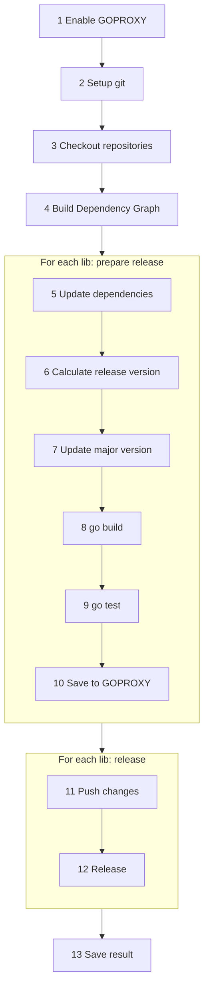

# Go Bulk Release CLI – Design Specification

## Main Algorithm

The tool takes a list of related repositories to be released together.  
It builds a dependency graph and, according to this graph, performs two phases for each library:

1. **Prepare release** – ensures that a release is possible by performing validation and pre-release actions.
2. **Perform release** – executes the actual release steps.

All preparation steps are performed **locally**, without modifying remote repositories.
The tool uses the configured `GOPROXY` as a **staging storage** for pre-release versions, ensuring that dependencies between libraries can be validated and tested before any changes are pushed to GitHub.

The tool automatically determines the release version based on [Conventional Commits](https://www.conventionalcommits.org/) since the last release.

The output includes:

- A new GitHub release for each repository
- A dependency graph in `dot` format
- A list of all libraries with their newly released versions

### Step Descriptions

1. **Enable GOPROXY** – The tool uses a local file-based `GOPROXY` to store intermediate versions without pushing them to GitHub. At this step, it registers a GOPROXY for the directory provided in the `goProxyDir` parameter.
2. **Setup git** – Configures Git using the parameters `gitURL`, `gitUsername`, `gitEmail`, and `gitPassword`.
3. **Checkout repositories** – Clones the repositories into the directory specified by `baseDir`.
4. **Build Dependency Graph** – Constructs a dependency graph between the repositories. Repositories are processed in topological order: from lower-level to higher-level ones.
5. **Update dependencies** – Updates dependencies of all modules in the repository to new versions of lower-level libraries.
6. **Calculate release version** – Determines the next release version from commit history since the previous release, using [go-semantic-release](https://github.com/go-semantic-release/semantic-release).
7. **Update major version** (optional) – If the new release version increments the `MAJOR` part of SemVer, the module name and all imports are updated accordingly. This step uses [gomajor](https://github.com/icholy/gomajor).
8. **go build** – Builds the repository with `go build`.
9. **go test** – Runs repository tests. This step can be skipped with the `skipTests` flag.
10. **Save to GOPROXY** – Packages the current repository state as a Go module and saves it in the local GOPROXY (these modules are later consumed by step **Update dependencies**), using [go-pack](https://github.com/taurmorchant/go-pack).
11. **Push changes** – Pushes all modifications to GitHub.
12. **Release** – Creates a Git tag based on the calculated version, publishes the release, and generates release notes, using [go-semantic-release](https://github.com/go-semantic-release/semantic-release).
    This step only runs if the **prepare release** phase completed successfully. It can be disabled with the `dryRun` flag.
13. **Save result** – Generates files with the dependency graph and the list of updated repositories with their new versions.
